# ***Jumpking2*** 

## **Introduction** 

+ Họ và tên: Lê Đức Hoàng Anh - K68CB - UET

+ Mã sinh viên: 23020004

+ Bài tập lớn: **JumpKing2** (INT2215_50 - Lập trình nâng cao)
# Phụ lục
- [Description](#description)
  * [Game description and instruction](#game-description-and-instruction)
  * [Control](#control)
  * [Preview](#preview)
- [Objects In game](#objects-in-game)
- [Setup](#setup)
- [Play Game](#play-game)
- [See also](#see-also)
  * [Các kỹ thuật sử dụng](#các-kỹ-thuật-sử-dụng)
  * [Các nguồn tham khảo](#các-nguồn-tham-khảo)
  * [Mô tả mã nguồn](#mô-tả-mã-nguồn)
- [Conclusion](#conclusion)
  * [Điều tâm đắc](#điều-tâm-đắc)
  * [Hạn chế](#hạn-chế)
  * [Hướng phát triển](#hướng-phát-triển)
- [A Special Thanks To](#a-special-thanks-to)

## **Description** 
### *Game description and instruction* 
- Đây là trò chơi được phát triển từ game JumpKing, một tựa game quen thuộc với lối chơi cuốn hút.
- **Jumpking2** được xây dựng xây dựng trên cơ sở thư viện SDL2, với 3 chế  độ chơi, đa dạng trải nghiệm người dùng:
  + Chế độ truyền thống (Classic).
  + Chế độ phản lực (Rocket).
  + Minigame - Chế độ kéo thả (Rope). 
- Người chơi bên cạnh cố gắng đạt điểm số cao nhất, còn được quy đổi điểm thành đơn vị tiền, sử dụng trong giao diện Shop để mua các phụ kiện như mũ đội, vương viện, hiệu ứng di chuyển, chủ đề map,...
- Bản đồ đa dạng chức năng với hiệu ứng nứt vỡ, trơn trượt, mối đe dọa từ lazer.
- Có âm thanh di chuyển, nhạc nền, hiệu ứng tuyết rơi,...
- Game có đầy đủ các nút chức năng hỗ trợ người chơi, như các giao diện cài đặt, tùy chỉnh, hay hướng dẫn cách thao tác ngay trong game.
- **Jumpking2** chắc chắn sẽ không khiến cho người chơi phải thất vọng với những tính năng, đồ họa độc đáo mới lạ.
- Video demo :
### *Control* 

| Control  |   Player   |
|----------|------------|
| UP       |      ↑     |
| LEFT     |     <-     |
| RIGHT    |     ->     |

- **LEFT MOUSE**: Tạo phản lực trong chế độ Rocket, kéo thả dây trong chế độ Rope, và thao tác các nút bấm trên màn hình.

#### CLASSIC MODE

-Nhấn giữ phím **UP** để căn lực dựa vào thanh lực mép dưới màn hình (hoặc dựa vào cảm giác :>).
-Nhấn một trong hai phím **LEFT** hoặc **RIGHT** để chọn hướng nhảy, nếu không, nhân vật sẽ nhảy thẳng đứng.
-Nhả phím **UP** để hoàn thành tổ hợp phím cho động tác nhảy.

#### FLY MODE
- Dùng chuột trái click vào các vùng phía dưới nhân vật, tạo ra phản lực cho tên lửa đẩy nhân vật theo hướng ngược lại.
#### ROPE MODE (đang hoàn thiện)
-Kéo thả chuột để điều chỉnh hướng và lực đàn hổi của dây để "bắn" nhân vật tới các trạm treo dây tiếp theo.

### *Preview*
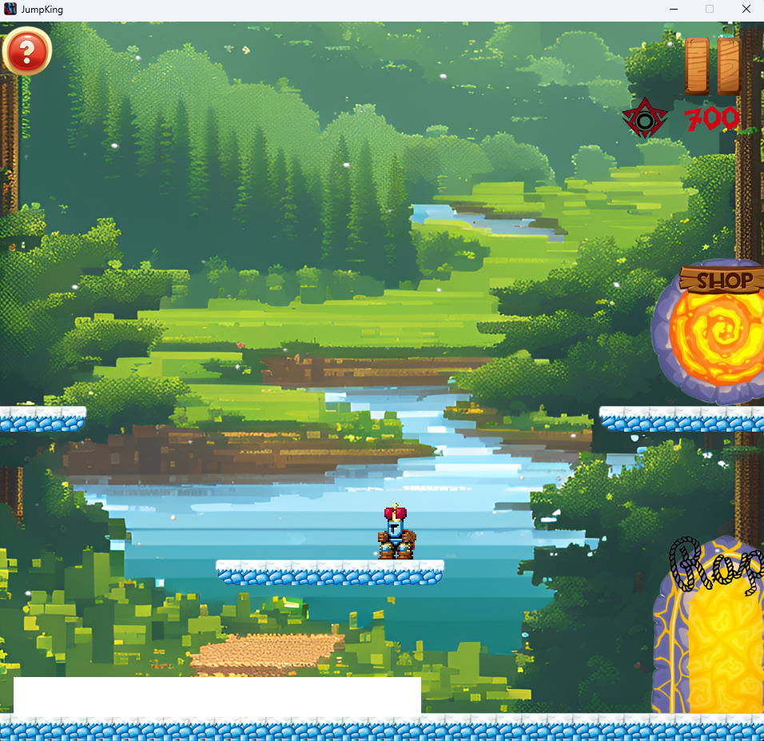
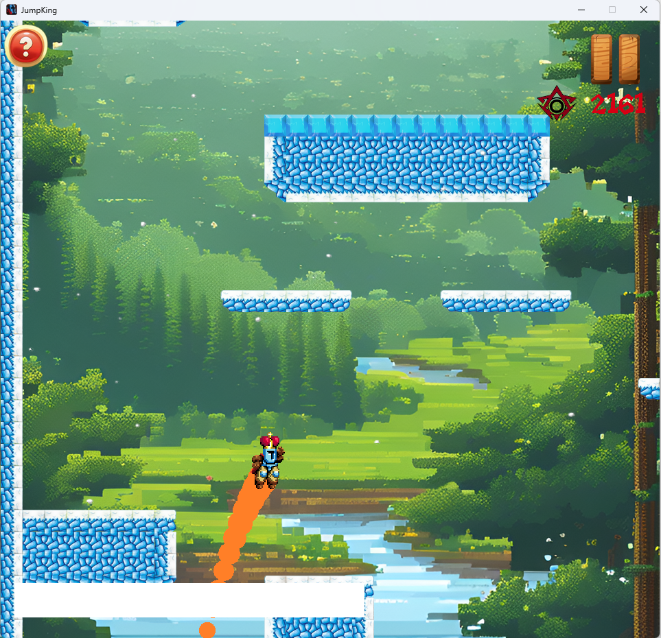
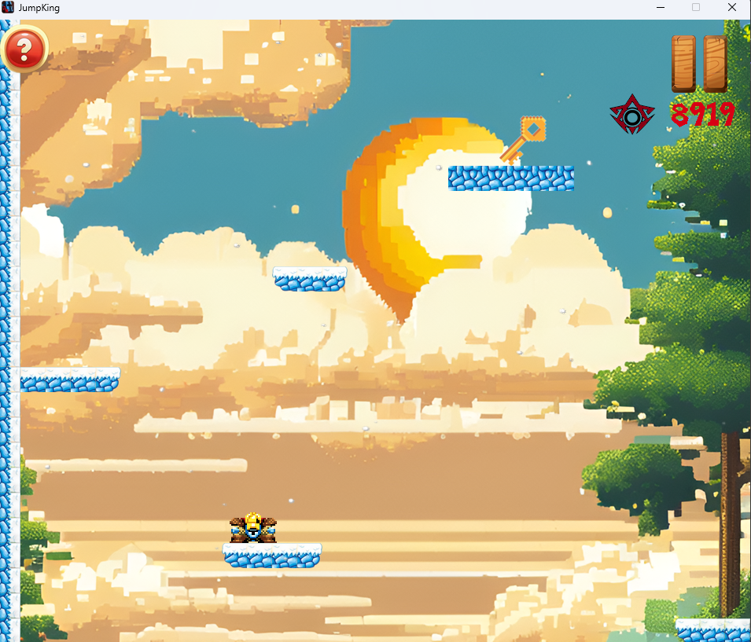
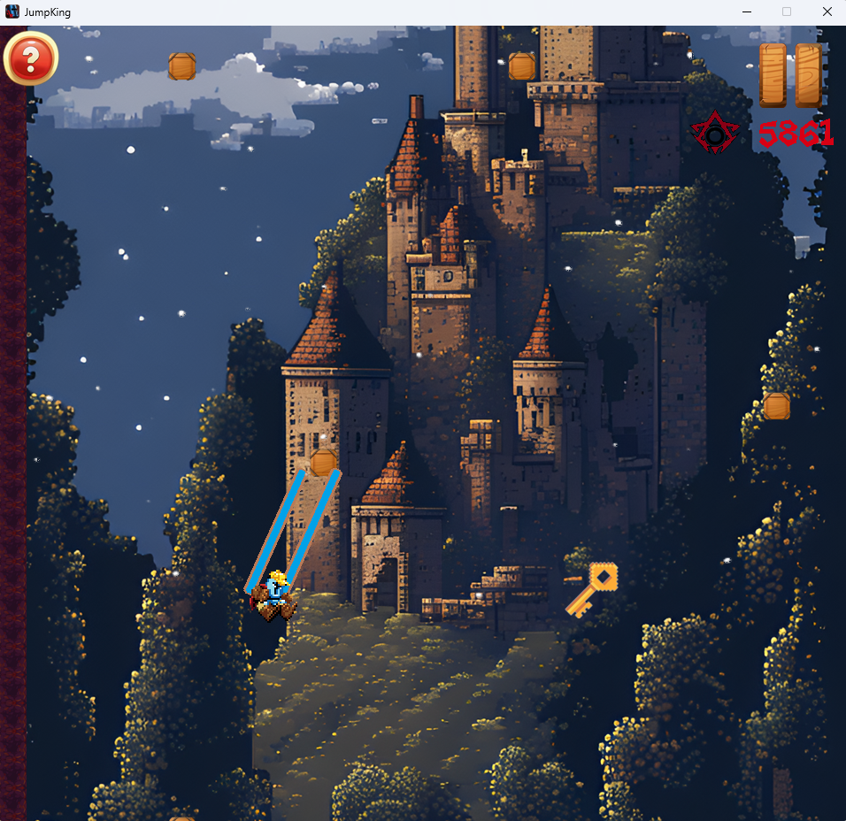

## **Objects In game**
|                                         | Tên đối tượng 	       | Mô tả                                                                                        |
|-----------------------------------------|--------------------|--------------------------------------------------------------------------------------------------|
| 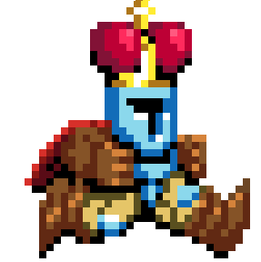 | King | Nhân vật chính của game|
|  | Common tile map| Các khối bản đồ thông thường|
|  | Force bar | Thanh căn lực|
|    | Tilted map block | Khối bản đồ nghiêng, bị trượt xuống khi rơi vào |
|    | Breaking Ice| Khối băng non, dễ vỡ khi đứng trên|
|  | Blue Ice | Khối băng, trơn trượt|
| 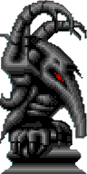   | Lazer Statue | Bức tượng phóng tia Lazer |
|    | Rope tile | vị trí nối dây co dãn trong chế độ Rope |
|    | Key | Chìa khóa, cần để mở cửa qua màn, mở hòm kho báu |
| 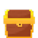   | Treasure| Kho báu, chứa phần thưởng cuối cùng của các chế độ chơi|
| 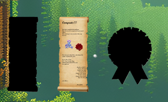   | Archiverment| Thành tựu đạt được qua việc hoàn thành màn chơi |
| 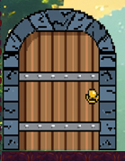   | Stage gate | Cửa qua màn |
| 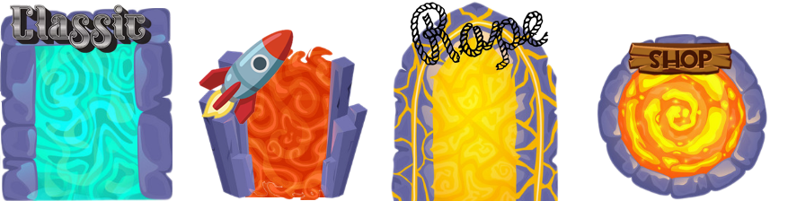   | Mode gate | Cửa chọn chế độ chơi, shop|
| 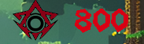   | Height | Độ cao đạt được, quy đổi thành đơn vị tiền khi kết thúc lượt chơi  |
| 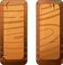   | Pause Game Button | Nút dừng Game  |
| 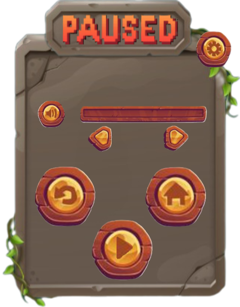   | Menu | Bảng tùy chọn  |
| 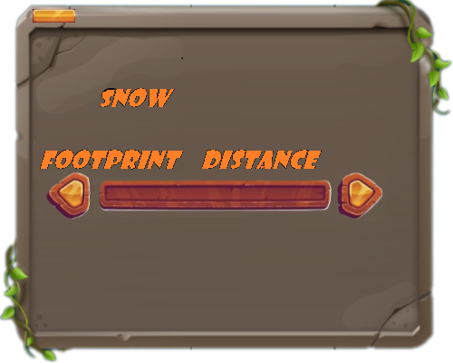   | Setting board | Bảng tùy chỉnh cài đặt  |
| 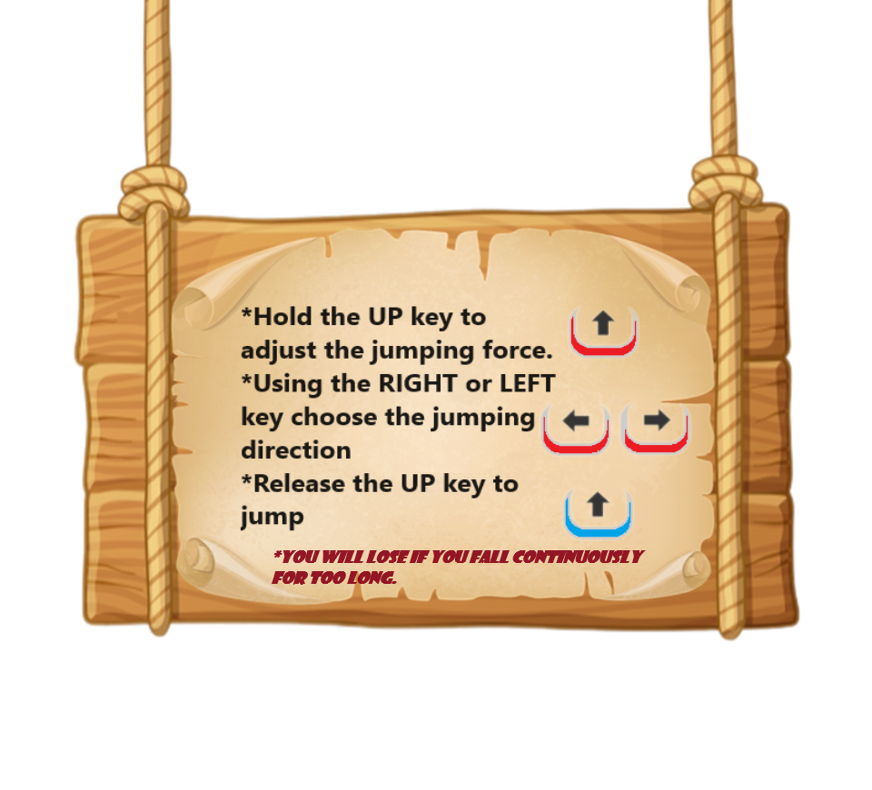   | Tutorial Button | Nút bảng hướng dẫn thao tác |

## **Setup**
- Yêu cầu : có C++ compiler.
    1. Tạo một New Folder bất kỳ, dùng terminal: $ git clone https://github.com/annhldh/JumpKing
    2. Vào thư mục vừa tải về, ấn đúp vào file Project2.sln .
    3. Biên dịch và chạy chương trình đề chơi game.
- *Mọi khó khăn trong phần cài đặt, trong quá trình chơi, vui lòng liên hệ qua 23020004@vnu.edu.vn.*

## **Play Game**
- Khi bắt đầu, nhân vật sẽ được xuất hiện trong một giao diện bản đồ ban đầu, gọi là giao diện sảnh.
- 
  
- Tại đây, người chơi có thể lựa chọn những cánh cổng để bắt đầu chơi những chế độ Classic, Rocket, minigame_Rope, hay vào Shop.
-Mục tiêu của bất cứ chế độ chơi nào là dùng phương thức di chuyển đặc trưng của từng chế độ (nhảy, bay, kéo thả) để di chuyển lên trên, tìm kiếm chìa khóa, cửa qua màn.

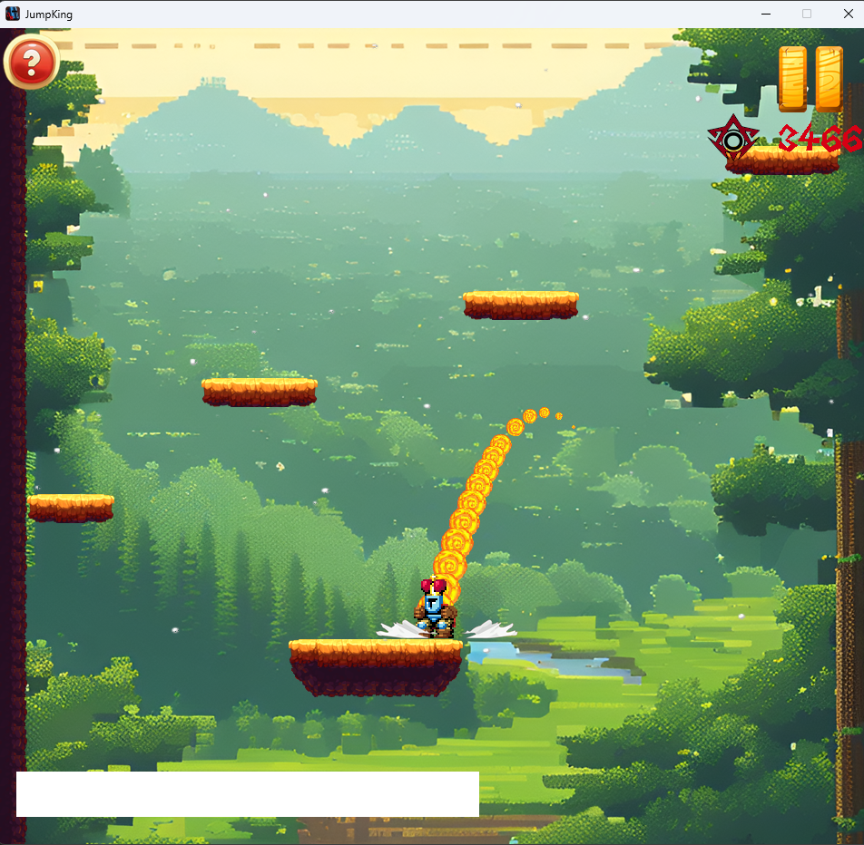  
-Đồng thời người chơi phải chú ý tránh né những mối nguy hiểm như Bức tượng Lazer, Băng vỡ, hay không được để rơi quá cao.

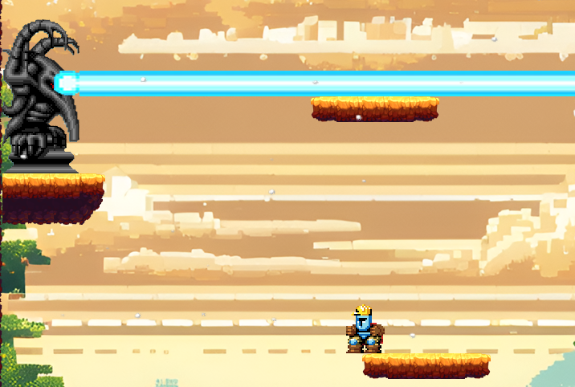  
-Khi có chìa khóa và đến cửa qua màn, người chơi sẽ được chuyển đến màn tiếp theo, độ cao người chơi đạt được ở map trước sẽ được tích lũy qua các màn chơi của một chế độ, dùng để tính điểm cao trên Leaderboard. Đồng thời giá trị này cũng được chuyển hóa chuyển hóa thành đơn vị tiền sử dụng trong Shop.

  
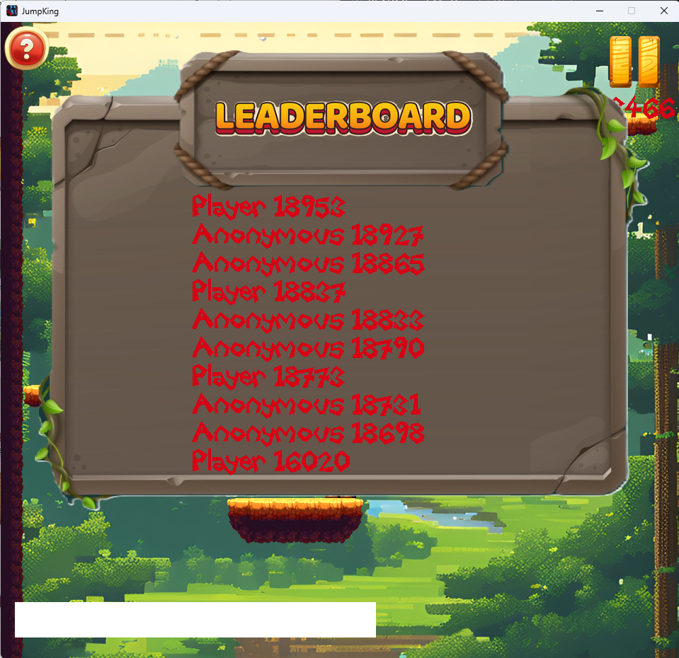  

-Ở màn cuối, thay vì tìm cửa chuyển màn, người sẽ di chuyển đến vị trí kho báu để mở và nhận được các vật phẩm thành tựu như Chứng thư, hoặc Huy chương.
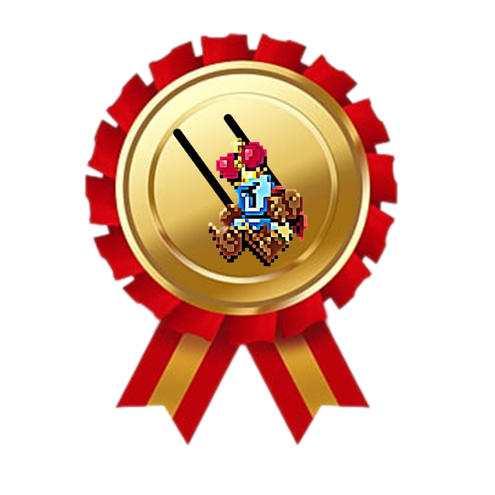 
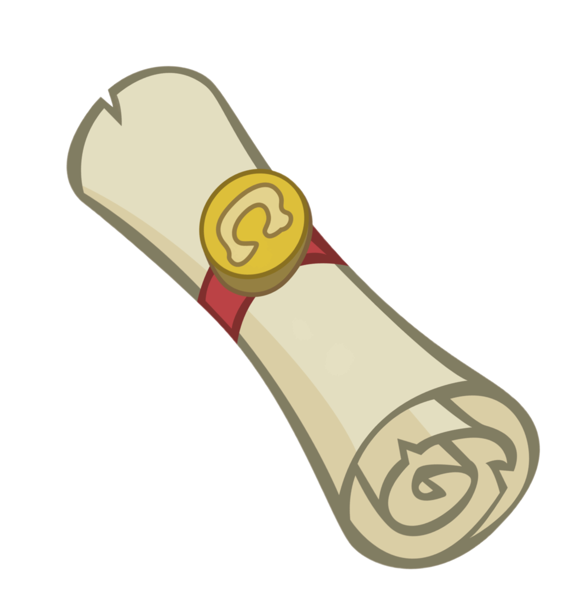 

-Vật phẩm thành tựu sẽ được trưng bày ở góc trên bên trái giao diện sảnh.

 
-Bên cạnh đó, trong giao diện shop, người chơi có thể dùng tiền tích lũy 
được để mua những vật phẩm như mũ, con chỏ chuột, hiệu ứng di chuyển, hay đổi chủ đề map.

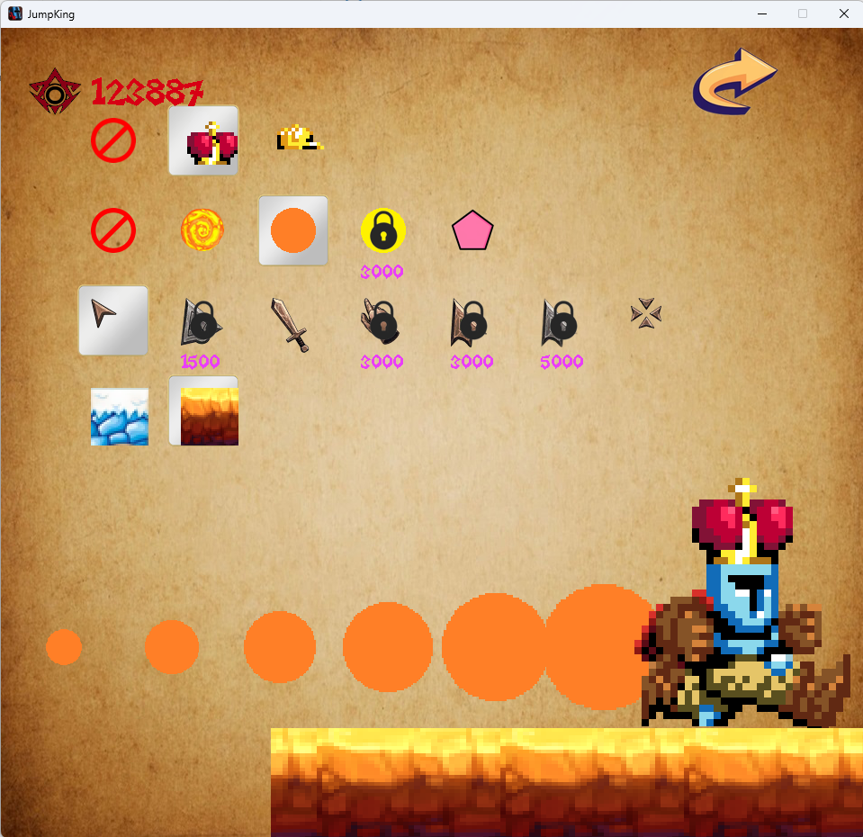  

## **See also**  
### *Các kỹ thuật sử dụng*  
- Thư viện SDL2.
- Kĩ thuật Tile map.
- Tạo nhiều đối tượng với từng class riêng: Nhân vật, bản đồ, Tutorial, Shop, Phần thưởng ...
- Có thể lưu lại điểm cao nhất sau mỗi lần chơi nhờ đọc và ghi file.
- Sử dụng nhiều class, struct, con trỏ, xâu chuỗi, biến, vòng lặp, cấu trúc rẽ nhánh,...
- Xử lý thời gian, thao tác chuột và bàn phím, âm thanh, hình ảnh, chữ.
- Tạo Option khi chơi : menu, setting, pause game, play game, restart game, exit game, điều chỉnh âm lượng và hiệu ứng,..
- Sử dụng Photoshop và MS.Paint để edit các ảnh dựa trên các nguồn khác nhau.
- Sử dụng kiến thức toán học, vật lí để tính toán va chạm của nhân vật và map, tính toán chuyển động trên không của nhân vật.

### *Các nguồn tham khảo**
- Cách sử dụng, cài đặt SDL2.0 trên C++:kênh web **Phattrienphanmem123az.com**.
- Cách sử dụng, thư viện SDL2.0, quản lý chương trình:
    + Các buổi học lý thuyết của **TS.Lê Đức Trọng**.
    + Các buổi học thực hành của **CN. Trần Trường Thủy**.
    + Các bài viết tham khảo trên **Phattrienphanmem123az.com**.
    + Các bài viết hướng dẫn trên **Lazyfoo**.
- Hình ảnh: 
    + Các trang web ảnh: Pinterest, Freepik, Istock,...
    + Resouces file của game gốc.
- Âm thanh: các nguồn trên google
  
    + https://pixabay.com/sound-effects/search/wav/
    #Free Wav Sound Effects Download
    + https://www.freesoundeffects.com/free-sounds/
    #Free Explosion Sound Effects
    + Nhạc nền từ game gốc.
 ...
 -Tự đánh giá: Code có tham khảo, chủ yếu là cách vận dụng kĩ thuật Tile map, cách sử đọc sự kiện, phương pháp xét va chạm giữa nhân vật và map.
### *Mô tả mã nguồn**
- main: chứa vòng lặp chính, nơi khởi tạo các đối tượng và logic kết hợp các thành phần để game hoạt động.
- Object: Class đối tượng cơ bản, bao gồm hình ảnh, kích thước và các hàm hỗ trợ Load và Render hình ảnh của đối tượng.
- King: Class kế thừa Object, nhân vật chính của game, bao gồm hình ảnh chuyển động, các chỉ số kích thước, vị trí, chỉ số trạng thái,... của nhân vật và các hàm hỗ trợ Load, Render hình ảnh, frames, xử lí tương tác với map và các đối tượng khác.
- game_map : Class chứa dữ liệu về map của các màn chơi, các hình ảnh của các loại ô map, và các hàm hỗ trợ Load, Render và các hàm hỗ trợ
- CommonFunc: Chứa các hắng số quan trọng của game như kích thước cửa sổ, kích thước map, trọng lực, Color_key,...
- Sound : Chứa các hàm quản lí và phát âm thanh: nhạc nền, sự kiện âm thanh,...
- SFX : Chứa các file âm nhạc và hiệu ứng âm thanh.
- Shop : Quản lí giao diện shop, chứa các file hình ảnh vật phẩm, chỉ số trạng thái các vật phẩm và các hàm hỗ trợ hiển thị, cập nhật trạng thái.
- LoadData: Chứa các hàm Load và lưu trữ dữ liệu liên quan khi chạy và tắt game.
- Setting: Class phục vụ giao diện cài đặt.
- Victory: Class tạo video khi nhận phần thưởng.
- Archive: Class quản lí hệ thống các vật phẩm thành tựu.
- Tutorial: Class 
  
## **Conclusion**
### ***Điều tâm đắc***
  - Dự án đầu tiên tự mình hoàn thành một cách hoàn chỉnh.
  
  - Hiểu được mô hình phát triển 1 phần mềm kiểu thác nước: Phân tích, thiết kế, lập trình, kiểm thử, vận hành và bảo trì.
  - Học được cách setup môi trường, sử dụng thư viện ngoài (SDL2, SDL2_ttf, SDL2_mixer, SDL2_image, ...)
  - Hiểu được cách dùng github.
  - Cải thiện kỹ năng sử dụng class, sử dụng các các loại biến, hàm, con trỏ, hằng, define,...  
  - Học được kỹ thuật tile map, duyệt mảng, lưu trữ, nhập xuất file, giải phóng bộ nhớ động.
  - Hiểu sơ qua một số khía cạnh của lập trình hướng đối tượng: kế thừa, đa hình,...
  - Sau khi hoàn thành dự án này, em nhận thấy mình đã phát triển đáng kể các kỹ năng trong tư duy và viết code, cũng như khả năng lên ý tưởng, tổ chức và phân loại file, cùng với kỹ năng sử dụng Photoshop.

    
### ***Hạn chế*** 
  - Một số đối tượng trong chương trình chưa được giải phóng hợp lí khi kết thúc chương trình.
  - Một số phần code chưa trong sáng, còn chưa được tổ chức mạch lạc.

### ***Hướng phát triển***
- Cập nhật tính năng bảng xếp hạng, sau mỗi lần chơi người chơi sẽ được nhập tên để lưu lại kết quả chơi của mình với tên tùy ý.
- Thêm các chế độ, minigame mới.
- Cập nhật các Màn mới, đa dạng hóa hệ thống phần thưởng.
- Sử dụng kết nối mạng máy tính (LAN, Router,...) kết nối người chơi cạnh tranh với nhau trong bảng xếp hạng chung.
  
# **A Special Thanks To**
- **TS. Lê Đức Trọng** - Người hướng dẫn, Giảng viên.
- **CN. Trần Trường Thủy** - Người hướng dẫn, Giảng viên.
- **SV Nguyễn Hoàng Dương** - Cố vấn.

