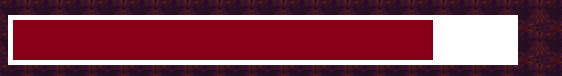
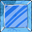

# ***Jumpking2*** 

## **Introduction** 

+ Họ và tên: Lê Đức Hoàng Anh - K68CB - UET

+ Mã sinh viên: 23020004

+ Bài tập lớn: **JumpKing2** (INT2215_50 - Lập trình nâng cao)
# Phụ lục
- [Description](#description)
  * [Game description and instruction](#game-description-and-instruction)
  * [Control](#control)
  * [Preview](#preview)
- [Objects In game](#objects-in-game)
- [Setup](#setup)
- [Play Game](#play-game)
- [See also](#see-also)
  * [Các kỹ thuật sử dụng](#các-kỹ-thuật-sử-dụng)
  * [Các nguồn tham khảo](#các-nguồn-tham-khảo)
  * [Các nguồn tham khảo](#các-nguồn-tham-khảo)
- [Conclusion](#conclusion)
  * [Điều tâm đắc](#điều-tâm-đắc)
  * [Hạn chế](#hạn-chế)
  * [Hướng phát triển](#hướng-phát-triển)
- [A Special Thanks To](#a-special-thanks-to)
- [Mức điểm tự đánh giá](#mức-điểm-tự-đánh-giá)

## **Description** 
### *Game description and instruction* 
- Đây là trò chơi được phát triển từ game JumpKing, một tựa game quen thuộc với lối chơi cuốn hút.
- **Jumpking2** được xây dựng xây dựng trên cơ sở thư viện SDL2, với 3 chế  độ chơi, đa dạng trải nghiệm người dùng:
  + Chế độ truyền thống (Classic).
  + Chế độ phản lực (Rocket).
  + Minigame - Chế độ kéo thả (Rope). 
- Người chơi bên cạnh cố gắng đạt điểm số cao nhất, còn được quy đổi điểm thành đơn vị tiền, sử dụng trong giao diện Shop để mua các phụ kiện như mũ đội, vương viện, hiệu ứng di chuyển, chủ đề map,...
- Bản đồ đa dạng chức năng với hiệu ứng nứt vỡ, trơn trượt, mối đe dọa từ lazer.
- Có âm thanh di chuyển, nhạc nền, hiệu ứng tuyết rơi,...
- Game có đầy đủ các nút chức năng hỗ trợ người chơi, như các giao diện cài đặt, tùy chỉnh, hay hướng dẫn cách thao tác ngay trong game.
- **Jumpking2** chắc chắn sẽ không khiến cho người chơi phải thất vọng với những tính năng, đồ họa độc đáo mới lạ.
- Video demo :
### *Control* 

| Control  |   Player   |
|----------|------------|
| UP       |      ↑     |
| LEFT     |     <-     |
| RIGHT    |     ->     |

- **LEFT MOUSE**: Tạo phản lực trong chế độ Rocket, kéo thả dây trong chế độ Rope, và thao tác các nút bấm trên màn hình.

#### CLASSIC MODE

-Nhấn giữ phím **UP** để căn lực dựa vào thanh lực mép dưới màn hình (hoặc dựa vào cảm giác :>).
-Nhấn một trong hai phím **LEFT** hoặc **RIGHT** để chọn hướng nhảy, nếu không, nhân vật sẽ nhảy thẳng đứng.
-Nhả phím **UP** để hoàn thành tổ hợp phím cho động tác nhảy.

#### FLY MODE
- Dùng chuột trái click vào các vùng phía dưới nhân vật, tạo ra phản lực cho tên lửa đẩy nhân vật theo hướng ngược lại.
#### ROPE MODE (đang hoàn thiện)
-Kéo thả chuột để điều chỉnh hướng và lực đàn hổi của dây để "bắn" nhân vật tới các trạm treo dây tiếp theo.

### *Preview*

## **Objects In game**
|                                         | Tên đối tượng 	       | Mô tả                                                                                        |
|-----------------------------------------|--------------------|--------------------------------------------------------------------------------------------------|
|  | King | Nhân vật chính của game|
|  | Common tile map| Các khối bản đồ thông thường|
|  | Force bar | Thanh căn lực|
|    | Tilted map block | Khối bản đồ nghiêng, bị trượt xuống khi rơi vào |
|    | Breaking Ice| Khối băng non, dễ vỡ khi đứng trên|
|  | Blue Ice | Khối băng, trơn trượt|
|    | Lazer Statue | Bức tượng phóng tia Lazer |
|    | Unexpected Threat | vị trí nối dây co dãn trong chế độ Rope |
|    | Key | Chìa khóa, cần để mở cửa qua màn, mở hòm kho báu |
|    | Treasure| Kho báu, chứa phần thưởng cuối cùng của các chế độ chơi|
|    | Archiverment| Thành tựu đạt được qua việc hoàn thành màn chơi |
|    | Stage gate | Cửa qua màn |
|    | Mode gate | Cửa chọn chế độ chơi, shop|
|    | Height | Độ cao đạt được, quy đổi thành đơn vị tiền khi kết thúc lượt chơi  |
|    | Pause Game Button | Nút dừng Game  |
|    | Menu | Bảng tùy chọn  |
|    | Setting board | Bảng tùy chỉnh cài đặt  |
|    | Tutorial Button | Nút bảng hướng dẫn thao tác |

## **Setup**
- Yêu cầu : có C++ compiler.
    1. Tạo một New Folder bất kỳ, dùng terminal: $ git clone https://github.com/annhldh/JumpKing
    2. Vào thư mục vừa tải về, vào thư mục Debug/.
    3. Ấn đúp vào Project2.exe.
- *Mọi khó khăn trong phần cài đặt, trong quá trình chơi, vui lòng liên hệ qua 23020004@vnu.edu.vn.*

## **See also**  
### *Các kỹ thuật sử dụng*  
- Thư viện SDL2.
- Kĩ thuật Tile map.
- Sử dụng nhiều class, vector, tách file, con trỏ, xâu chuỗi,biến, vòng lặp, cấu trúc rẽ nhánh, mảng, ...
- Tạo nhiều đối tượng với từng class riêng: Nhân vật, bản đồ, Tutorial, Shop, Phần thưởng ...
- Có thể lưu lại điểm cao nhất sau mỗi lần chơi nhờ đọc và ghi file.
- Xử lý thời gian, thao tác chuột và bàn phím, âm thanh, hình ảnh, chữ.
- Tạo menu và các nút di chuyển giữa các menu.
- Tạo Option khi chơi : pause game, play game, restart game, exit game, điều chỉnh âm lượng, hiệu ứng,..
- Sử dụng photoshop để edit các ảnh dựa vào một số mẫu ảnh từ các nguồn khác.
- Sử dụng kiến thức toán học, vật lí để tính toán va chạm của nhân vật và map, chuyển động trên khồng của nhân vật.

### *Các nguồn tham khảo**
- Cách sử dụng, cài đặt SDL2.0 trên C++: tham khảo từ các bạn, kênh web **Phattrienphanmem123az.com**.
- Cách sử dụng, thư viện SDL2.0, quản lý chương trình:
    + Các buổi học lý thuyết của **TS.Lê Đức Trọng**.
    + Các buổi học thực hành của **CN. Trần Trường Thủy**.
    + Các bài viết tham khảo trên **Phattrienphanmem123az.com**.
    + Các bài viết hướng dẫn trên **Lazyfoo**.
- Hình ảnh: 
    + Các trang web ảnh: Pinterest, Freepik, Istock,...
    + Resouces file của game gốc.
- Âm thanh: các nguồn trên google
  
    + https://pixabay.com/sound-effects/search/wav/
    #Free Wav Sound Effects Download
    + https://www.freesoundeffects.com/free-sounds/explosion-10070/
    #Free Explosion Sound Effects
    + Nhạc nền từ game gốc.
 ...
## **Conclusion**
### ***Điều tâm đắc***
  - Dự án này hoàn toàn là do em tự làm, không đi sao chép ở bất kì đâu.
  - Hiểu được mô hình phát triển 1 phần mềm kiểu thác nước: Phân tích, thiết kế, lập trình, kiểm thử, vận hành và bảo trì.
  - Hiểu được cách dùng github.
  - Hiểu sơ qua một số khía cạnh của lập trình hướng đối tượng: kế thừa, đa hình,...
  - Sau khi làm dự án này, em thấy mình đã cải thiện được nhiều kỹ năng trong việc tư duy và viết code, khả năng lên ý tưởng, sắp xếp chia tách file và các kỹ năng photoshop.
  - Học được cách setup môi trường, sử dụng thư viện ngoài (SDL2, SDL2_ttf, SDL2_mixer, SDL2_image, ...)
  - Cải thiện kỹ năng sử dụng class (constructor, destructor, member function,...), sử dụng các các loại biến, hàm, con trỏ, hằng, define,...  
  - Học được kỹ thuật tile map, duyệt mảng, lưu trữ, nhập xuất file, giải phóng bộ nhớ động.

    
### ***Hạn chế*** 
  - Một số đối tượng trong chương trình chưa được giải phóng hợp lí khi kết thúc chương trình
  - Một số phần code chưa trong sáng.

### ***Hướng phát triển***
- Cập nhật tính năng bảng xếp hạng, sau mỗi lần chơi người chơi sẽ được nhập tên để lưu lại kết quả chơi của mình với tên tùy ý.
- Thêm các chế độ, minigame mới.
- Cập nhật các Màn mới, đa dạng hóa hệ thống phần thưởng.
- Áp dụng hệ thống sử dụng tiền và nạp tiền:
    + Thêm cửa hàng để mua trang phục và vật phẩm bổ trợ.
    + Sử dụng tiền thưởng kiếm được từ việc nạp tiền hoặc đạt được lúc chơi game.
    + Người chơi nạp tiền vào game, số tiền sẽ chuyển vào tài khoản nhà phát hành.
- Sử dụng kết nối mạng máy tính (LAN, Router,...) kết nối người chơi cạnh tranh với nhau trong bảng xếp hạng chung.
  
# **A Special Thanks To**
- **TS. Lê Đức Trọng** - Người hướng dẫn, Giảng viên.
- **CN. Trần Trường Thủy** - Người hướng dẫn, Giảng viên.
- **SV Nguyễn Hoàng Dương** - Cố vấn.

# *Mức điểm tự đánh giá*

